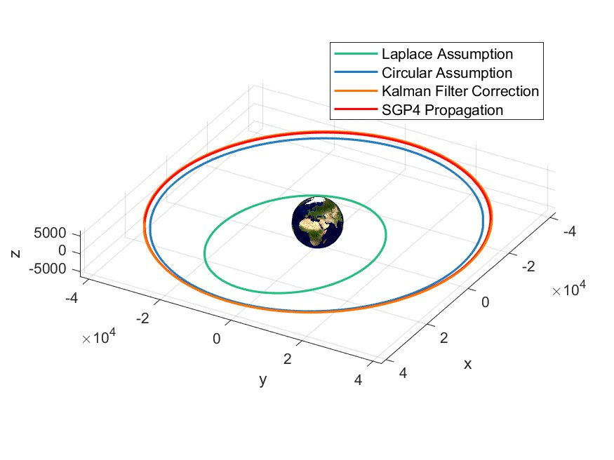

# Initial Orbit Determination

This project was developed as the continuation of the Satellite Observations project, in which we start from a set of TLEs to compute an observations strategy to be followed during the observation window. Subsequently, once the observations have been taken, we have created a dataset, which will be the input for this project.
Hence, the goal of this project is to perform an application of three different Initial Orbit Determination methods on three different datasets and compare their results.
Note that this project is developed around three different datasets but it is NOT limited to them.

Methods Comparison            |  Trace of the Covariance Matrix
-------------------------|-------------------------
 | 

### Table of Contents
- [Introduction to Initial Orbit Determination](#introduction-to-initial-orbit-determination)
- [Laplace (3-Point) Initial Orbit Determination](#laplace-3-point-initial-orbit-determination)
- [Circular Initial Orbit Determination](#circular-initial-orbit-determination)
- [Kalman Filter Initial Orbit Determination](#kalman-filter-initial-orbit-determination)

## Introduction to Initial Orbit Determination

We start with three different datasets we can choose from, each one containing the observations of a different satellite. The satellites in question are the following:
* Sentinel 3A
* Sentinel 3B
* Beidou

Once we have chosen the satellite we will also need to load the associated TLE and the Earth Observation Parameters relative to the observation date.

Finally, for comparison purposes we will also compute the real orbit of the satellite using the SGP4 Propagator from the TLEs, which will be used as a reference for the results of the three different methods.

## Laplace (3-Point) Initial Orbit Determination

The Laplace Method, also known as the 3-Point Gauss Method, is a widely-used technique for Initial Orbit Determination (IOD). The main purpose of the method is to derive the initial orbital elements (i.e., the position and velocity vectors) of an object orbiting in space, given three position measurements at three distinct times.
These position vectors are ideally observed from a single location (such as a ground station or another spacecraft) and are provided in an appropriate Earth-Centered Inertial (ECI) frame.

### *Methodology*

1. **Data Retrieval:** The right ascensions and declinations from the three observations (`RA1`, `RA2`, `RA3`, `DEC1`, `DEC2`, `DEC3`) and corresponding times (`t1`, `t2`, `t3`) are extracted from the input data.

2. **Compute Observations Position Vectors:** The unit vectors `L1`, `L2`, and `L3` are computed from the right ascension and declination of each observation.

3. **Interpolation:** The position versor `L`, angular velocity `dL`, and angular acceleration `ddL` of the satellite are computed using linear interpolation of `L1`, `L2`, and `L3` with the adjusted times.

4. **Compute Local Variables:** Variables `D`, `D1`, and `D2` are computed, which involve determinants of vectors `L`, `dL`, `ddL`, `ddRgs`, and `Rgs`.

5. **Solve for rho and r:** These are the geometric range and the magnitude of the position vector of the satellite, respectively. They are solved using two equations involving `rho`, `r`, and the previously computed local variables.

6. **Select Real Solutions:** The script selects the real and positive solutions for `rho` and `r` from the possible solutions obtained.

7. **Compute Position and Velocity Vectors:** The position vector (`r_vect`) and velocity vector (`v_vect`) of the satellite at time `t`, which is the intermediate time `t2`, are finally computed using the solved values of `rho` and `r`, and the given variables. If multiple acceptable solutions are found or if no acceptable solution is found, the script throws a warning or an error, respectively.

## Circular Initial Orbit Determination

The `CircularIOD` function performs Initial Orbit Determination (IOD) when two optical observations are available, under the assumption of a circular orbit. The goal is to compute the initial position and velocity of a satellite using the right ascensions and declinations from two observations. These observations are provided in an Earth-Centered Inertial (ECI) frame. The method employs an iterative process, beginning with an initial guess for the range between the satellite and observer at the first observation (`rho1_0`).

### *Methodology*

1. **Data Retrieval:** The right ascensions and declinations (`RA1`, `RA2`, `DEC1`, `DEC2`) and corresponding times (`t1`, `t2`) of the two observations are extracted from the input data.

2. **Compute Observations Position Vectors:** The unit vectors `L1` and `L2` are computed using the right ascension and declination of each observation.

3. **Iterative Computation of rho1:** The function sets up an iterative process to calculate `rho1`, the geometric range from the observer to the satellite at the first observation. The process commences with an initial guess for `rho1`, increasing it with a small step size (`rho_step`) each iteration until the optimization condition is met.

4. **Computation of r1_vect and r:** `r1_vect`, the position vector of the satellite at the first observation, is calculated as the sum of the observer's position (`Rgs1`) and the product of `rho1` and `L1`. The magnitude of `r1_vect` is denoted as `r`.

5. **Solve for rho2:** The geometric range `rho2` between the observer and the satellite at the second observation is computed using `L2`, `Rgs2`, and `r`.

6. **Computation of r2_vect:** `r2_vect`, the position vector of the satellite at the second observation, is computed as the sum of the observer's position (`Rgs2`) and the product of `rho2` and `L2`.

7. **Angular Difference and Actual Angular Velocity Calculation:** The angle `dtheta` between `r1_vect` and `r2_vect` is calculated. Using the time difference `dt` between the two observations, the actual angular velocity `omega_act` of the satellite is determined.

8. **Check for Convergence:** The iterative process checks if the absolute difference `J` between the actual angular velocity `omega_act` and the theoretical angular velocity `omega_th` (derived from `mu` and `r`) is less than a tolerance `J_tol`. If `J` is less than this tolerance, the optimization flag `opt_flag` is set to 0, terminating the iterative process.

9. **Compute Velocity Vector:** Finally, the velocity vector `v1_vect` of the satellite at time `t1` is computed using the orbital angular momentum vector `h_hat`, the unit vector `r1_hat` in the direction of `r1_vect`, and the magnitude of the velocity `v1`.

## Kalman Filter Initial Orbit Determination

In this part of the code, the Kalman Filter is applied from the first estimate found in the Circular IOD. We choose this starting point since our orbits are nearly circular, but if that wasn't the case it would be best to change the initial state to the one found using the SGP4 propagation, or `X0_SGP4`. 

### *Methodology*

###### *Initialization*

1. The code begins by defining the initial covariance matrix `P0` with TLE Accuracy.
2. Initial conditions are defined by the variable `X0`, which are the initial state estimates derived from the SGP4 model.
3. Measurement error matrix `R` and model error matrix `Q` are defined.
4. Two matrices `X` and `Ps` are initialized for storing the state estimates and covariance matrices at each iteration.

###### *Kalman Iterations*

1. Iterations are performed using a loop.
2. For each iteration, the state is propagated using the `DynamicalModel_Kalman` dynamical model, where `Phi` is the state transition matrix.
3. The covariance is propagated to get the estimated covariance `P_est` at the next time step.
4. The Kalman Gain Matrix `K` is computed, which balances the contribution between the measurement and the predicted state in the updated state estimate.
5. The innovation is computed as the difference between the actual measurement `z` and the measurement predicted from the propagated state `zf`.
6. The state update `Xf_upd` is computed as the product of the Kalman Gain and the innovation. This update is then added to the propagated state to get the updated state `Xf`.
7. The updated covariance `Pk` is computed.
8. The function checks whether `Pk` and `P_est` are positive definite using the `isPositiveDefinite` function.
9. The state estimates and the covariance matrix are stored in `X` and `Ps` respectively.

###### *Results*

1. The final state estimate `Xf_KF` is obtained.
2. The covariance matrix traces are plotted, which represent the evolution of the total variance in the state estimates.
3. The classical orbital elements are calculated and displayed.
4. The state estimates are compared between the Kalman Filter and SGP4 Propagation.

The entire process relies on the correct modeling of the satellite dynamics and the measurement function, which directly impact the quality of the state estimates.

**Contributor:** Leonardo Russo

**Last Updated:** 05/05/2023
